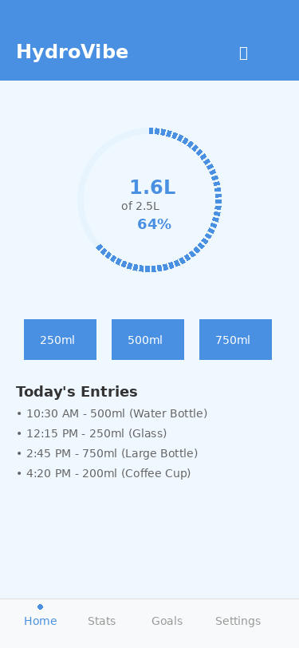
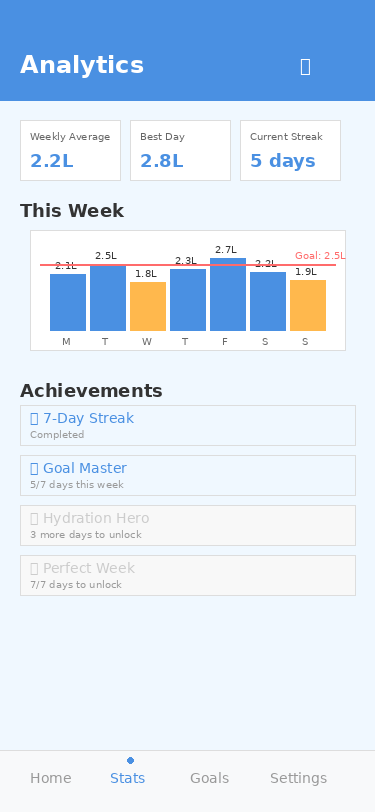
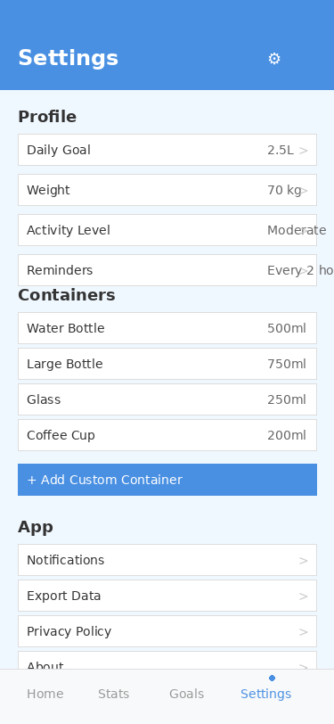

# HydroVibe 💧

> A smart .NET MAUI app that transforms hydration tracking into a delightful daily habit.



## Overview

HydroVibe is a cross-platform mobile application designed to help users maintain optimal hydration levels through intelligent tracking, personalized reminders, and comprehensive analytics. Built with .NET MAUI, it delivers native performance on both iOS and Android platforms.

### Key Features

🚰 **Smart Water Logging**
- One-tap quick-add buttons for common volumes
- Custom container support with personalized volumes
- Visual progress tracking with animated indicators
- Undo functionality for easy corrections

📊 **Comprehensive Analytics** 
- Weekly and monthly hydration trends
- Achievement system with unlockable badges
- Personal statistics and progress insights
- Goal achievement tracking

⏰ **Intelligent Reminders**
- Adaptive notification scheduling based on your habits
- Weather and activity-aware reminder frequency
- Customizable quiet hours and notification styles
- Non-intrusive, gentle nudges to stay hydrated

🎯 **Personalized Experience**
- Individual goals calculated from body weight and activity level
- Machine learning-powered habit recognition
- Custom container library with your favorite bottles and cups
- Dark/light theme support with accessibility features

## Screenshots

<table>
<tr>
<td></td>
<td></td>
<td></td>
</tr>
<tr>
<td align="center">Main Dashboard</td>
<td align="center">Analytics & Insights</td>
<td align="center">Settings & Profile</td>
</tr>
</table>

## Why HydroVibe?

### The Problem
- **70% of adults** don't drink enough water daily
- **Busy lifestyles** make it easy to forget hydration
- **Generic recommendations** don't account for individual needs
- **Complex apps** overwhelm users with unnecessary features

### Our Solution
HydroVibe focuses exclusively on making hydration tracking **simple, smart, and sustainable**:

✅ **Simplicity First**: Clean, intuitive interface that doesn't overwhelm  
✅ **Smart Automation**: Learns your patterns and adapts accordingly  
✅ **Habit Formation**: Built on behavioral psychology principles  
✅ **Privacy-Focused**: Your data stays on your device by default  

## Target Users

- **Health-Conscious Individuals**: People actively working to improve wellness habits
- **Fitness Enthusiasts**: Athletes and gym-goers who need optimal hydration
- **Busy Professionals**: Office workers who forget to drink water during hectic days
- **Medical Patients**: Individuals with conditions requiring hydration monitoring
- **Parents**: Families wanting to track hydration for all members

## Technical Highlights

- **Framework**: .NET MAUI 8.0+ for native cross-platform performance
- **Architecture**: MVVM pattern with dependency injection
- **Storage**: SQLite with optional cloud synchronization
- **Platforms**: iOS 12+, Android 7.0+ (API 24)
- **Performance**: Sub-2-second app launch, < 100MB memory usage
- **Offline-First**: Full functionality without internet connection

## Getting Started

### For Users
1. Download HydroVibe from the App Store or Google Play
2. Set up your profile (weight, activity level, goals)
3. Add your favorite water containers
4. Start logging your water intake!

### For Developers
```bash
# Clone the repository
git clone https://github.com/mattleibow/vibe-code.git

# Navigate to project directory
cd vibe-code

# Restore dependencies
dotnet restore

# Build the project
dotnet build

# Run on your preferred platform
dotnet build -t:Run -f net8.0-android
# or
dotnet build -t:Run -f net8.0-ios
```

## Documentation

Comprehensive documentation is available in the [docs](./docs/) folder:

- **[App Concept](./docs/app-concept.md)**: Detailed feature overview and user personas
- **[Technical Specifications](./docs/technical-specs.md)**: Architecture, data models, and implementation details  
- **[User Guide](./docs/user-guide.md)**: Complete guide for using all app features

## Roadmap

### Phase 1: Foundation (Current)
- [x] Core water logging functionality
- [x] Basic progress tracking and goals
- [x] Simple reminder system
- [x] Cross-platform UI implementation

### Phase 2: Intelligence
- [ ] Advanced analytics and trend analysis
- [ ] Machine learning-powered habit insights
- [ ] Weather integration for smart suggestions
- [ ] Achievement system and gamification

### Phase 3: Integration
- [ ] Health app synchronization (Apple Health, Google Fit)
- [ ] Wearable device support (Apple Watch, Wear OS)
- [ ] Social features and family sharing
- [ ] Advanced ML-powered personalization

## Contributing

We welcome contributions! Please see our [Contributing Guidelines](CONTRIBUTING.md) for details on:

- Code standards and style guidelines
- Pull request process
- Issue reporting
- Development setup

## Privacy & Security

HydroVibe is built with privacy as a core principle:

- **Local-First**: All data stored locally by default
- **Optional Cloud Sync**: User-controlled backup and synchronization
- **No Personal Data Collection**: We don't collect personally identifiable information
- **Transparent Permissions**: Clear explanation of all required device permissions

## License

This project is licensed under the MIT License - see the [LICENSE](LICENSE) file for details.

## Support

- **Bug Reports**: [GitHub Issues](https://github.com/mattleibow/vibe-code/issues)
- **Feature Requests**: [GitHub Discussions](https://github.com/mattleibow/vibe-code/discussions)
- **Documentation**: Check our [User Guide](./docs/user-guide.md)
- **Contact**: [Create a new issue](https://github.com/mattleibow/vibe-code/issues/new) for support

---

**Stay Hydrated, Stay Healthy!** 💧

Made with ❤️ using .NET MAUI